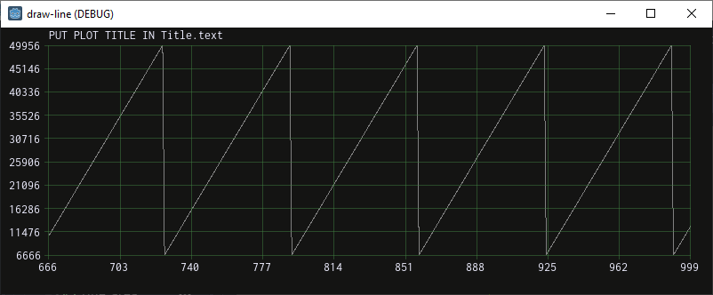
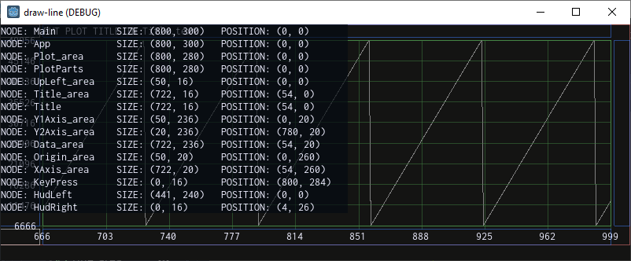
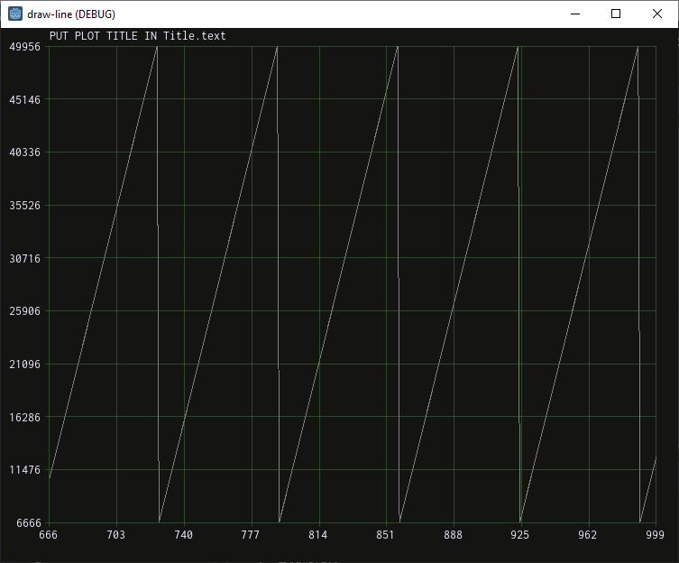

# Draw-line

I made this for interactive plotting of data. It's such a common
task I am shocked there are no existing solutions that meet all
my criteria. I'm not generating plots for publishing in papers or
making pretty slides. I'm plotting data to understand it better.

I made this primarily for me: I want a flexible way to look at my
data and a way to build intuition by "playing" with data
(plotting it in different views, combining datasets, simulating
noise, and whatever else I can think of).

But I'm also making this for my collaborators. A "game" (an
interactive application that compels the user to be creative)
is the best medium I've found to share intuition/insights in
general (and in this case, intuition about our data).

I use the word "game" instead of "application" or "(the) build".
"Game" is a better description *and* it's less letters. It also
implies my dual intent: as a user, I want to deeply engage with
the application, and as an engineer, I want to remind myself that
the human condition is to deal in representations, never direct
contact with reality itself.

This GitHub repository is the official site for this project.

https://github.com/sustainablelab/draw-line

I am prototyping it using the Godot game engine. For now, and for
a long while from now, the Godot prototype is good enough. I
expect I'll eventually run up against obstacles in the Godot
engine (for example, there is no USB communication unless it's a
keyboard/mouse). When that happens, I'll re-roll the whole thing
in C.

Until then...

## ToC

On this page:

- [Status](README.md#status)
- [Next steps](README.md#next-steps)
- [Why did I make this](README.md#why-did-i-make-this)

Other docs (these are in the `doc` folder):

- [Getting Started](doc/start.md)
- [How I made this Godot project](doc/godot.md)
- [How I auto-document Godot code from its comments](doc/summarize-my-code.md)

## Status

This is still in a very early stage. Right now it just plots a
sawtooth:

In fact, this is so early that I'm just going to describe *all*
the functionality in this **Status** section.

### Functionality

- `Esc` quits the game.
- `F1` toggles bounding boxes around the draw areas in the UI:

    

- `F2` toggles a debug window with the node name, size, and
  position of each draw area:

    

- `F3` toggles a debug overlay that displays the mouse position:
    - on the screen
        - xy-coordinate in pixels
    - on the plot
        - xy-coordinate using x-axis and y-axis instead of screen pixels
        - data lookup:
            - x-coordinate is still the nearest x-axis value
            - but y-coordinate is a lookup in the data using the
              x-coordinate

    

Lastly, resizing the window (dragging the window corner like in
any other application, or maximizing the window) resizes the plot
area:

## Next steps

- [ ] mouse zoom/pan control
- [ ] open a file browser to load data from file
- [ ] plot multiple plots
- [ ] do math on plot data
    - [ ] generate statistics
    - [ ] find area under the plot

## Why did I make this

At work I use Python and [bokeh](https://bokeh.org/), but I want
a few things I don't know how to get with those tools:

### Standalone executable

Collaborators just clone the repo and, voila, they have a
plotting utility. No need to waste their time walking them
through a bunch of *dev* stuff:

- install Python
- update the Python install
- create and activate a virtual environment
- install the Python package dependencies
- and then I'm finally at the step of showing them how to use
  bokeh :)

### Do not use the browser as a GUI

I'm not saying using the browser is bad, I think that was a neat
idea. But making a standalone application feels like it ought to
be easier to perform well versus involving a web browser.

Plus:

- a standalone GUI that is just plotting data consumes less RAM
  than running a browser
- I already do other stuff in my browser, so bokeh messes up my
  workflow
    - e.g., say my bokeh script opens 20 tabs of plots
    - if I forget to put that in a new window, now I have to
      close those bokeh tabs one a time

### More control over the UI

**bokeh** is powerful but I spend a lot of time bending it to my
will and later, re-learning how I made it do that cool thing.
Instead of digging through their API documentation, it's just as
much work (but more worth my time) to roll the functionality
myself.

Plus I can add all sorts of stuff that is completely outside the
realm of a plotting API, like custom keyboard shortcuts, a
built-in file browser, and getting real-time data over USB.

*As I mentioned above, Godot has no built-in support for USB. But
for work (at a company that makes a sensor), I made a Godot game
that plots data from our sensor over USB in real-time.*

If Godot has no USB support, how did I do that? Our sensor has a
Python API, so I used the Godot `pythonscript` addon to access
our sensor API Python package. Cool, so what's the problem?

Unfortunately `pythonscript` is in beta. One of the missing
features is easy builds. Easy builds are one of Godot's
strengths, but a `pythonscript` dependency breaks the build
process. In practice this means that sharing the executable with
collaborators is difficult on Windows (it's all the friction of
sharing a Python application and then some) and impossible if
they are on macOS.

